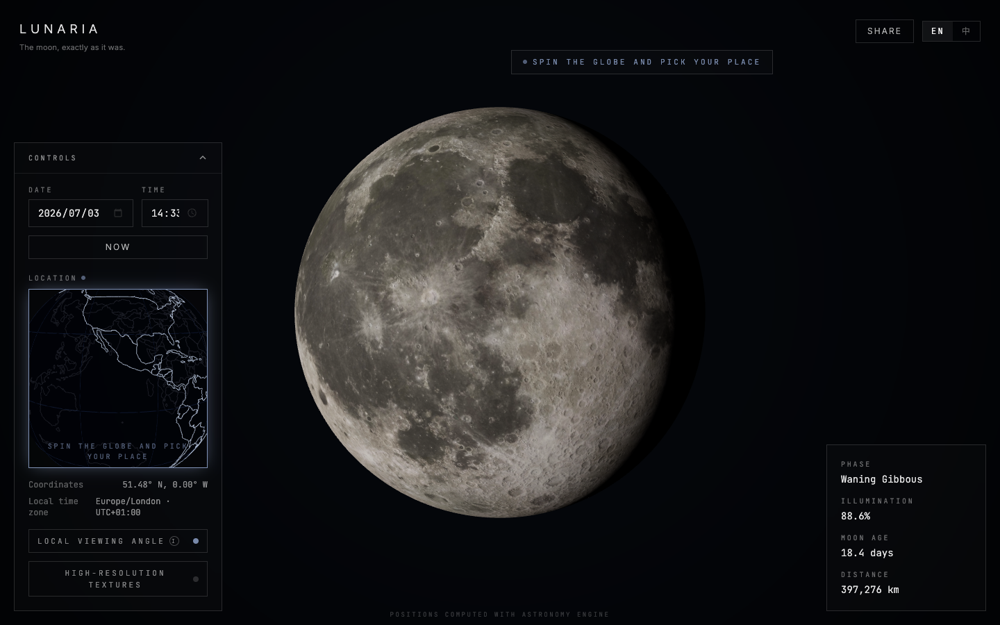

# Lunaria · 那一刻的月亮

<p align="center">
  
</p>

<p align="center">
  <strong>中文</strong> · <a href="#english">English</a>
</p>

<p align="center">
  极简、现代、科技感的月相网站 —— 选择日期、时间与地点，还原那一刻真实可见的月亮。
</p>

---

## 目录

- [简介](#简介)
- [功能特性](#功能特性)
- [快速开始](#快速开始)
- [GitHub Pages 部署](#github-pages-部署)
- [使用说明](#使用说明)
- [技术栈](#技术栈)
- [项目结构](#项目结构)
- [天文精度说明](#天文精度说明)
- [资源与致谢](#资源与致谢)
- [English](#english)

---

## 简介

**Lunaria** 是一个面向 Web 的交互式月相可视化应用。在太空黑背景与星空下，你可以：

1. 在 **3D 线框地球仪** 上点击选择观测地点  
2. 设定 **日期与时间**（按当地当地时间理解）  
3. 查看 **高解析度 3D 月球** —— 月相、明暗交界、天平动与本地观测倾斜角，均按真实天文计算呈现  
4. 生成 **纪念分享卡片**（PNG），附带日期、地点与自定义留言  

> *The moon, exactly as it was.*  
> *那一刻的月亮，分毫不差。*

---

## 功能特性

| 功能 | 说明 |
|------|------|
| **真实月相渲染** | 基于 [astronomy-engine](https://github.com/cosinekitty/astronomy) 站心计算：照亮比例、相位角、亮边方位、天平动 |
| **物理光照** | 太阳平行光定义明暗交界；地球地照提供暗面微弱补光 |
| **本地观测角度** | 默认开启，按所选地点与时刻还原月亮在夜空中的真实倾斜；关闭后可自由旋转查看 |
| **3D 地球仪选点** | 线框球体 + 经纬网 + 海岸线，点击即可选取坐标 |
| **时区感知** | 日期/时间按当地墙钟时间解释，自动解析时区并处理夏令时 |
| **分享卡片** | 导出 PNG，含月亮快照、日期、地点、月相与留言；内置「你出生那天的月亮」等候选文案 |
| **中英双语** | 跟随浏览器语言，右上角可切换 English / 中文 |
| **线条风 UI** | 细描边、等宽字体、留白与微光，控制面板可折叠 |

---

## 快速开始

### 环境要求

- Node.js 18+
- npm / pnpm / yarn

### 安装与运行

```bash
# 克隆仓库
git clone https://github.com/<your-username>/Lunaria.git
cd Lunaria

# 安装依赖
npm install

# 启动开发服务器
npm run dev
# 访问 http://localhost:5173

# 生产构建（本地）
npm run build

# 预览 GitHub Pages 构建效果（与线上一致）
VITE_BASE=/Lunaria/ npm run build && npm run preview
```

---

## GitHub Pages 部署

本项目已配置 GitHub Actions，推送到 `main` 分支后自动部署。

**在线地址：** `https://<your-username>.github.io/Lunaria/`

### 首次启用步骤

1. 在 GitHub 创建仓库，名称设为 **`Lunaria`**（区分大小写）
2. 推送代码到 `main` 分支
3. 打开仓库 **Settings → Pages**
4. **Build and deployment → Source** 选择 **GitHub Actions**
5. 等待 Actions 中 `Deploy to GitHub Pages` 工作流完成（约 1–2 分钟）
6. Pages 设置页会显示站点 URL

### 手动触发部署

Actions 页 → **Deploy to GitHub Pages** → **Run workflow**

### 本地模拟线上路径

GitHub Pages 项目站点的资源路径为 `/Lunaria/`，本地开发默认 `/`。若要本地验证 Pages 构建：

```bash
VITE_BASE=/Lunaria/ npm run build
npm run preview
# 访问 http://localhost:4173/Lunaria/
```

---

## 使用说明

1. **选择地点**  
   首次打开时，顶部与地球仪区域会提示「转动地球仪，选择你的地点」。在左侧控制面板的地球仪上点击即可选点；选点后提示自动消失。

2. **设定时间**  
   选择日期与时间，或点击「此刻 / Now」回到当前时刻。时间按**所选地点的当地时间**计算。

3. **查看月亮**  
   - **本地观测角度**（默认开启）：月亮按你在该地实际仰望时的倾斜角呈现，视角锁定。  
   - 关闭该选项后，可拖拽自由旋转月球，从任意角度观察表面细节。

4. **分享**  
   点击右上角「分享 / Share」，选择或编辑留言，下载 PNG 纪念卡片。

5. **高解析度贴图**  
   在控制面板底部开启「高解析度贴图」，加载 8K 月球纹理（默认 2K，加载更快）。

---

## 技术栈

| 类别 | 技术 |
|------|------|
| 构建 | Vite · React · TypeScript |
| 3D | three.js · @react-three/fiber · @react-three/drei |
| 天文 | astronomy-engine |
| 时区 | tz-lookup |
| 状态 | zustand |
| 国际化 | i18next · react-i18next |
| 分享 | html-to-image |
| 样式 | Tailwind CSS |
| 地图数据 | world-atlas · topojson-client · d3-geo |

---

## 项目结构

```
Lunaria/
├── public/
│   ├── textures/          # 月球贴图 (2K / 8K)
│   └── moon.svg
├── docs/
│   └── preview.png        # 预览图
├── src/
│   ├── components/        # UI 与 3D 组件
│   │   ├── MoonScene.tsx  # 主场景 (Canvas)
│   │   ├── Moon.tsx       # 月球网格与光照
│   │   ├── GlobePicker.tsx# 线框地球仪
│   │   ├── ControlsPanel.tsx
│   │   ├── ShareDialog.tsx
│   │   └── ...
│   ├── lib/
│   │   ├── astronomy.ts   # 天文计算
│   │   ├── timezone.ts    # 时区与 UTC 换算
│   │   └── share.ts       # 分享卡片导出
│   ├── i18n/              # 中英文文案
│   ├── store.ts           # 全局状态
│   └── App.tsx
├── package.json
└── README.md
```

---

## 天文精度说明

本项目的月相与光照方向基于 **站心天文计算**（observer-centric），主要包含：

- **月相与照亮比例**：`Astronomy.Illumination`
- **天平动 (Libration)**：子地球点经纬偏移，使可见月面随日期微动
- **亮边方位**：太阳方向投影至以天北为上的图像平面，驱动 3D 场景中的平行光
- **视差角 (Parallactic angle)**：整组（月球 + 光照）旋转，还原当地观测者看到的倾斜

光照在**与月面贴图一致的天北朝上坐标系**中计算，再施加视差旋转，以保证北半球「盈月右亮、亏月左亮」等直觉与真实观测一致。

> 本项目面向科普与纪念用途，计算精度依赖 astronomy-engine，未替代专业天文软件或观测设备。

---

## 资源与致谢

- 月球贴图：[Solar System Scope](https://www.solarsystemscope.com/textures/)（2K / 8K）
- 天文计算：[cosinekitty/astronomy-engine](https://github.com/cosinekitty/astronomy)
- 海岸线数据：[world-atlas](https://github.com/topojson/world-atlas)

---

<a id="english"></a>

# Lunaria · Moon of the Day

<p align="center">
  <a href="#简介">中文</a> · <strong>English</strong>
</p>

<p align="center">
  A minimal, modern, space-black web app that shows the Moon exactly as it appeared — or will appear — for any date, time, and place on Earth.
</p>

---

## Table of Contents

- [Overview](#overview)
- [Features](#features)
- [Getting Started](#getting-started)
- [GitHub Pages](#github-pages)
- [Usage](#usage)
- [Tech Stack](#tech-stack-1)
- [Project Structure](#project-structure-1)
- [Astronomical Accuracy](#astronomical-accuracy)
- [Credits](#credits)

---

## Overview

**Lunaria** is an interactive web app for visualising the Moon at a specific moment in time and space:

1. Pick a location on an interactive **3D wireframe globe**
2. Set a **date and time** (interpreted as local wall-clock time at that place)
3. View a **high-resolution 3D Moon** with physically correct phase, terminator, libration, and local viewing tilt
4. Export a **keepsake share card** (PNG) with the Moon snapshot, metadata, and a custom message

---

## Features

| Feature | Description |
|---------|-------------|
| **Accurate lunar phase** | Topocentric computation via [astronomy-engine](https://github.com/cosinekitty/astronomy): illumination, phase angle, bright-limb orientation, libration |
| **Physical lighting** | Directional Sun light defines the terminator; subtle Earthshine fill on the dark side |
| **Local viewing angle** | On by default — shows the Moon at the tilt you'd actually see from the chosen place and time; turn off to freely rotate |
| **3D globe picker** | Wireframe sphere with graticule and coastlines; click to select coordinates |
| **Timezone-aware** | Date/time treated as local wall-clock time; timezone resolved from coordinates with DST support |
| **Share cards** | Export PNG with Moon snapshot, date, location, phase, and message; preset suggestions included |
| **i18n** | English / 中文, auto-detected; switchable in the header |
| **Line-style UI** | Thin borders, monospace accents, collapsible control panel |

---

## Getting Started

### Requirements

- Node.js 18+
- npm / pnpm / yarn

### Install & Run

```bash
git clone https://github.com/<your-username>/Lunaria.git
cd Lunaria
npm install
npm run dev      # http://localhost:5173
npm run build    # type-check + production build → dist/
npm run preview  # preview the production build
```

---

## GitHub Pages

The repo includes a GitHub Actions workflow (`.github/workflows/deploy.yml`) that deploys on every push to `main`.

**Live URL:** `https://<your-username>.github.io/Lunaria/`

1. Create a GitHub repo named **`Lunaria`**
2. Push to `main`
3. **Settings → Pages → Source:** select **GitHub Actions**
4. Wait for the workflow to finish

To preview the Pages build locally:

```bash
VITE_BASE=/Lunaria/ npm run build && npm run preview
# open http://localhost:4173/Lunaria/
```

---

## Usage

1. **Choose a location** — On first load, a prompt asks you to spin the globe and pick a place. Click anywhere on the wireframe globe in the control panel.
2. **Set date & time** — Or press **Now** to jump to the current moment. Times are interpreted as **local time at the selected place**.
3. **View the Moon** — With **Local viewing angle** on (default), the Moon is locked to the physically correct tilt for your location. Turn it off to drag and freely orbit the Moon.
4. **Share** — Click **Share**, edit your message, and download a PNG keepsake card.
5. **High-res textures** — Toggle **High-resolution textures** in the panel to load 8K maps (2K by default for faster loading).

---

## Tech Stack

| Category | Tools |
|----------|-------|
| Build | Vite · React · TypeScript |
| 3D | three.js · @react-three/fiber · @react-three/drei |
| Astronomy | astronomy-engine |
| Timezone | tz-lookup |
| State | zustand |
| i18n | i18next · react-i18next |
| Sharing | html-to-image |
| Styling | Tailwind CSS |
| Map data | world-atlas · topojson-client · d3-geo |

---

## Project Structure

See the [中文 section above](#项目结构) for the full directory tree — the layout is identical.

Key modules:

- `src/lib/astronomy.ts` — phase, libration, bright-limb, parallactic tilt
- `src/lib/timezone.ts` — local wall time → UTC
- `src/components/MoonScene.tsx` — main WebGL canvas
- `src/components/GlobePicker.tsx` — interactive wireframe globe

---

## Astronomical Accuracy

Lighting is computed in a **celestial-north-up frame** (matching the Moon texture orientation), then rotated by the parallactic angle to match the observer's local sky. This ensures familiar rules hold — e.g. waxing moons appear lit on the right in the Northern Hemisphere.

Intended for commemorative and educational use; not a substitute for professional ephemeris software or observational equipment.

---

## Credits

- Moon textures: [Solar System Scope](https://www.solarsystemscope.com/textures/)
- Astronomy: [cosinekitty/astronomy-engine](https://github.com/cosinekitty/astronomy)
- Coastlines: [world-atlas](https://github.com/topojson/world-atlas)

---

<p align="center">
  Made with care for the moonlit moments worth remembering.
</p>

<p align="center">
  为那些值得记住的月夜而制作。
</p>
